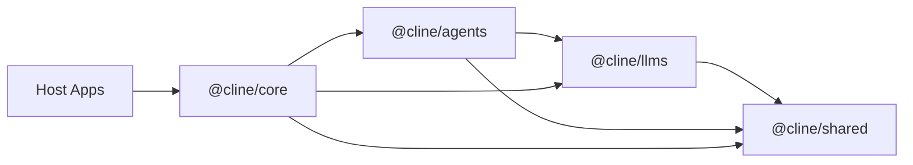

# Cline SDK Architecture

This document is the architecture source of truth for the Cline SDK repository. It describes how the system is organized, how components interact, and the design principles that guide development decisions.

**Who should read this?**
- SDK contributors working across multiple packages
- Developers building integrations or host applications using `@cline/core`
- Plugin authors understanding the runtime and extension systems

**What this covers:**
- Package boundaries and responsibilities
- Dependency direction and layering rules
- Runtime flows (local, hub-backed, remote-config managed)
- Design seams (repeated patterns instead of one-off integrations)
- Architectural constraints and why they exist

**What this is NOT:**
- An onboarding guide for new contributors (see README.md and CONTRIBUTING.md)
- A detailed API reference (see package READMEs and inline JSDoc)
- A user guide (see the main documentation)

## Layered Model

The workspace is organized as a layered runtime stack.

## Package Responsibilities

### `@cline/shared`

Owns reusable low-level contracts and infrastructure:

- shared types and schemas
- path resolution
- hook contracts/engine
- extension registry contracts
- prompt and parsing helpers
- storage path helpers
- remote-config schemas, managed instruction materialization, telemetry normalization, and blob upload primitives

Design rule:

- `shared` should not depend on higher-level runtime packages.

### `@cline/llms`

Owns model/provider runtime concerns:

- provider settings/config resolution
- model catalogs and manifests
- shared gateway-style provider contracts
- handler creation via an internal gateway registry
- AI SDK-backed provider execution code

Design rule:

- provider-specific behavior should be isolated here, not spread across `core` or apps.

### `@cline/agents`

Owns the stateless runtime loop:

- agent iteration loop
- tool orchestration
- runtime event emission
- hook/extension execution
- turn preparation before provider calls
- in-memory team/runtime primitives

Design rule:

- `agents` should not own persistent storage or host lifecycle concerns.

### `@cline/core`

Owns stateful orchestration:

- runtime composition
- session lifecycle
- storage and persistence
- config watching/loading and watcher projections
- settings listing and mutation orchestration
- default host tool assembly
- plugin discovery/loading
- default context compaction policy
- telemetry integration
- hub server and scheduled-runtime services under `src/hub/`
- hub discovery, the detached hub daemon, and the `@cline/core/hub/daemon-entry` subpath
- host-side hub client adapters (`NodeHubClient`, `HubSessionClient`, `HubUIClient`, `connectToHub`) exported from `@cline/core/hub`

Design rules:

- `core` is the app-facing orchestration layer over `agents`.
- hub-related modules live under `packages/core/src/hub/`, grouped by service:
  - `client/` contains host-facing hub clients and browser connection helpers
  - `daemon/` contains detached daemon startup, entrypoint, and local runtime handler wiring
  - `discovery/` contains endpoint defaults, discovery records, and workspace owner resolution
  - `server/` contains WebSocket server startup, native/browser socket adapters, server transport, server helpers, and `handlers/` for hub command dispatch
- `a2a/` contains the opt-in A2A HTTP mount (Agent Card discovery, JSON-RPC dispatch, SSE task streaming) layered over the hub transport
- settings mutations belong in core services and hub commands, not in host-specific file writes. Hosts should call the core settings facade or the `settings.*` hub command family and react to `settings.changed`.

## Runtime Flows

### Local In-Process Runtime

1. Host constructs a `RuntimeHost` through `@cline/core`.
2. `@cline/core` selects `LocalRuntimeHost` through `packages/core/src/runtime/host.ts`.
3. Hosts normalize broad local config into `RuntimeSessionConfig` plus `localRuntime` overrides before calling `RuntimeHost.start(...)`.
4. `@cline/core` prepares a local bootstrap artifact from `localRuntime`, then builds the runtime from it.
5. `@cline/core` creates an `Agent` from `@cline/agents`.
6. `@cline/agents` runs the loop using `@cline/llms` handlers.
7. `@cline/core` persists state, artifacts, and metadata.

Completion telemetry is anchored to the assistant's explicit completion
declaration, not session shutdown. After each agent turn, the local
runtime inspects `AgentResult.toolCalls` and emits `task.completed` the
moment a successful `submit_and_exit` (the SDK analog of original
Cline's `attempt_completion`) is observed. `shutdownSession(...)`
retains a fallback emission for completed sessions that finished
without an explicit completion-tool observation, so non-interactive
runs not using the yolo preset still produce a `task.completed` signal.
Each session emits at most one `task.completed`. See `DOC.md` for the
event payload and `source` field.

### Hub connection identity

The websocket upgrade authenticates the *connection* (bearer token, or a
loopback-origin allowance), but every command envelope also carries a
`clientId`, and the whole hub authorizes on that value. A server-issued
connection principal closes the gap between those two facts.

Each accepted socket is assigned an unguessable `connectionId` at upgrade time.
`BrowserWebSocketHubAdapter` binds that connection to the first client identity
it successfully registers, and from then on:

- any command other than `client.register` is refused with
  `hub_unregistered_client`;
- a command whose `envelope.clientId` names a different identity is refused
  with `hub_client_id_mismatch`;
- a command that omits `clientId` has the bound identity stamped onto it, so
  downstream handlers keep reading one field;
- `stream.subscribe` / `stream.unsubscribe` are subject to the same check, so a
  client cannot subscribe to another client's session events.

The connection id is also recorded as server-owned provenance on the client
record (`metadata.connectionId`, never client-supplied), which lets
`client.register` refuse to hand a live identity to a second connection
(`hub_client_id_taken`). An identity whose owning connection has gone away is
reclaimable, so an abrupt disconnect cannot permanently lock a client out of its
own id on reconnect. In-process callers (the A2A mount, tests) supply no
connection id and stay trusted, because they never cross a network boundary.

A client identity is still just an identity: it does not by itself grant access
to a session it does not own. See the session ACL note below for what is and is
not enforced there.

## Hub session ACL

> **Integrator contract — daemon restart.** Session *records* survive a daemon
> restart and stay readable, but **authority does not**. Ownership and
> participation live only in the daemon's in-memory `sessionState`, because
> session metadata is client-writable and a persisted owner claim could be
> replayed by any client. After a restart an existing session therefore has no
> provable owner: reads succeed, every write is refused with
> `session_wrong_client`, and the client re-establishes authority by issuing
> `session.create` (which may target the same session id). Do not build an
> integration that assumes a session you merely read is one you may drive.

Session ownership (`createdByClientId`) and participants have always been
modelled, but only the two compaction handlers ever checked them, so any
registered client could delete, resume, reconfigure, or drive another client's
session. Authorization is now a single table in
`hub/server/handlers/session-access.ts`, checked once in `dispatchCommand`
before any handler runs, so it cannot drift per handler again.

Commands declare the authority they need:

| Access | Commands |
|---|---|
| `own` | `session.delete`, `session.resume`, `session.update`, `session.update_connection`, `session.compaction.get`, `session.compaction.update`, `session.update_pending_prompt`, `session.remove_pending_prompt` |
| `write` | `run.start`, `session.send_input`, `run.abort`, `session.restore`, `session.hook` |
| `read` | `session.get`, `session.list`, `session.messages`, `session.attach`, `session.detach`, `session.pending_prompts` |

`own` is the owner alone, `write` is the owner or a `participant`, and `read` is
open to any client with an identity so a UI can watch a session it did not
create. Two properties matter:

- **Attaching never grants authority.** `session.attach` registers the caller as
  an `observer`, so it cannot be used to escalate to `write` or to pick up
  capability ownership. Ownership is only ever set by `session.create`.
- **Ownership is live state, not metadata.** Session metadata is client-writable,
  so a persisted owner claim could be replayed; ownership lives only in
  `ctx.sessionState`. A session whose state was lost (daemon restart) therefore
  has no provable owner: reads stay open, writes are refused, and the client
  re-establishes authority through `session.create`.

A command envelope with no `clientId` is treated as an in-process caller (the
A2A mount, internal handlers). Remote callers can never reach that branch: the
connection principal refuses unregistered commands and stamps the bound identity
on every frame it forwards.

## Hub credential and file boundaries

**Attached user files are confined to the session workspace.** `userFiles`
arrives from a client and used to be read straight off disk, so a remote client
could attach any path the daemon could read — `/etc/shadow`, an SSH private key —
and have the contents injected into the model context. Containment now lives at
the read, in `loadUserFileContent`, and the host injects it with the session's
`workspaceRoot`. The check resolves `realpath` on both sides, so it defeats
`..` traversal, an absolute path elsewhere, *and* a symlink planted inside the
workspace that points out of it; a workspace reached through a symlink compares
correctly too. A rejection is surfaced as `UserFileOutsideWorkspaceError` so it
is distinguishable from a missing file, and degrades to a per-file
`Error fetching content` block rather than failing the whole turn. Callers that
own their own trust boundary can still omit the root and keep the unconfined
behavior.

**Credential redaction is applied to projections, at the choke points.**
Auditing each projection separately is how a leak comes back, so redaction is
enforced where data is broadcast rather than where it is produced:
`HubServerTransport.publish` (every event payload), the session-record
projection (metadata and system prompt), and the client-registry projection
(`client.list` metadata). Two mechanisms combine: a value under a
credential-ish key is masked wholesale, which does not depend on recognizing a
secret's shape, and free-form strings are scanned for `Bearer …`, `key=value`,
and known provider key shapes. Only the projection is redacted — nothing here
changes what is persisted or what a provider request uses, so it cannot break a
call. Class instances are dropped rather than enumerated, depth and array length
are bounded, and event addressing fields (name, ids, session id) are not data and
pass through untouched.

### Durable Tool Effects

`AgentRuntime` enforces an optional per-run budget (`AgentRunBudget`) in addition
to the turn cap. The budget is a **pre-request stop gate**, not a reservation:
cumulative input tokens, output tokens, their sum, and provider cost are compared
against the configured caps before each model request, and the run that reached a
cap finishes its in-flight turn — so every tool call still receives a tool result
and the transcript stays valid — then ends with the controlled
`budget_exhausted` status instead of a thrown error. A structured
`status-notice` with the reached limit, cap, and usage is emitted so hosts and
UIs can explain the stop. Caps are validated once at construction: a non-finite,
zero, negative, or unknown field fails fast rather than degrading into an
unbounded run, and a budget with no caps set is simply absent. `budget_exhausted`
is deliberately excluded from team auto-continue, because continuing would issue
exactly the model call the budget refused to pay for. The budget is recorded in
the durable recovery state, so a replayed continuation keeps the guardrail that
stopped the original run. Budgets are per run, not per session, and are not yet
pooled across a delegated agent chain.

`LocalRuntimeHost` owns one SQLite-backed Effect Ledger for its execution
scope. `SessionRuntimeOrchestrator` wraps the final per-turn tool set rather
than mutating the configured tools, so extension tools and tools added later
in the session receive the same protection. The same wrapper is propagated to
configured sub-agents, spawned sub-agents, and teammates.

A tool step is keyed by session, durable run id, loop iteration, tool name,
call ordinal within the model response, and a stable hash of its input. The run
id is stored in checkpoint metadata and reused only by the first run of that
checkpoint restore; later turns receive new ids. Provider-generated tool-call
ids are audit metadata rather than part of the durable key, allowing a restored
model call to receive a new provider id without bypassing a recorded outcome.
The key still assumes the restored model preserves the logical call ordering
and input; a divergent path requires a durable application-level idempotency
key.

Claims use an immediate SQLite transaction. Only one owner receives a lease
token; completion is fenced by that token. An expired pending lease becomes
`in_doubt` and is never executed automatically. Thrown tool errors are also
`in_doubt` by default; only tools explicitly marked `retryable` can produce a
safe `failed` outcome that permits another attempt. Structured unsuccessful
results, including mixed result arrays, are not recorded as successful effects.

## Default tool middleware chain

`LocalRuntimeHost.createToolWrapper` composes two middleware around every tool the
session exposes, outermost first:

1. `createIdempotencyMiddleware` — the Effect Ledger, so a duplicate tool call is
   answered from a recorded outcome instead of re-entering the tool.
2. `createRedactionMiddleware` — scrubs credentials and PII out of the result
   before it reaches the model, the transcript, or telemetry. Its default patterns
   cover bearer tokens, `sk-` API keys, `ghp_` GitHub tokens, AWS `AKIA` keys, and
   email addresses; plain objects are rebuilt and class instances pass through
   untouched so buffers and dates are not destroyed.

Order is deliberate. Idempotency stays outermost so a repeat call is resolved from
the ledger, and redaction sits closest to the executor so the value being scrubbed
is the raw one on both the fresh and the ledger-cached path. Redaction filters a
result; it never blocks a call.

The redaction middleware was previously implemented, exported and unit-tested but
never added to this chain, so default tool results were unfiltered. It is covered
through the host's own `wrapTools` hook in `local-runtime-host.test.ts` rather than
in isolation, because a test of the middleware alone stays green if the chain loses
it again.

Checkpoint restore re-keys all source-session effects before workspace mutation
and before the restored session can execute its optional prompt. Succeeded
effects replay, pending/in-doubt effects remain blocked, and explicitly failed
effects may be retried. Active source sessions cannot be restored. Hub restore
delegates to the execution host, and the detached daemon shares one
`LocalRuntimeHost` between hub sessions and scheduled runs.

Durable approval state is stored by the core-owned `DurableToolApprovalCoordinator`
in a SQLite `approvals.db` beside the execution data. Each request is keyed by
session, durable run id, iteration, tool name, call ordinal, and input hash.
The store persists the request payload, policy, target/decision principal,
status, expiry, and decision reason. `pending` requests are atomically decided
once; expiry, abort, run cancellation, and session deletion become terminal
states. The local host and hub transport share one coordinator instance, and
`session.attach` republishes pending requests to the assigned client after a
reconnect. Hub clients that need reconnect recovery should configure a stable
`clientId`. A durable approval decision is separate from resumable run state. The MVP
continuation journal is `continuations.db`; it records the exact prepared input,
assistant-message boundary, approval id, phase, lease, and a versioned local
recovery snapshot. The snapshot stores only bounded server-runtime selectors
(`configExtensions` for rules/skills/workflows and a skills allowlist) plus an
aggregate SHA-256 source reference, never source contents or paths; it omits
API keys, provider credentials, raw callbacks, and client capability payloads.
 The continuation schema also stores a strict versioned `RunState` JSON
 manifest alongside the legacy snapshot. It contains a safe resume cursor
 (including the stable `stepId` for that pending call), transcript/config
 fingerprints, and bounded reconstruction selectors, but not
 raw tool input, transcript bodies, source content, secrets, callbacks, or
 process objects. The resume cursor is a versioned union: `tool_call` describes a
 single pending step, and `tool_call_batch` describes a whole assistant turn as an
 ordered, duplicate-free `steps` list with contiguous call ordinals. The host
 writes the turn-level cursor on the last continuation of a sequential turn, once
 every tool call of the persisted assistant message has a durable record, and
 keeps the per-step cursor while a turn is still incomplete. `RunState` also
  carries a serializable `agent` block (`agentId`, and for delegated runs the
  `parentAgentId`/`rootRunId`), so a resume can prove it rebuilds the same agent
  identity instead of trusting the caller's start input; a continuation whose
  agent block names a parent agent is refused until the agent chain itself is
  rebuildable. The continuation record also stores the requesting agent's chain in
  its own `agent_chain_json` column, so the refusal does not depend on a run state
  being present at all. Explicit resume prefers
 valid `RunState`, falls back to the legacy snapshot, and rejects identity,
 step-identity, agent-identity, or transcript drift. A batch resume additionally
 requires the recorded cursor to cover exactly the replayed continuations in
 persisted order and to match the persisted assistant turn (same message, same
 tool-call count, same call order); the same transcript proof guards a
 single-step resume, so replaying one call of a multi-tool turn is refused before
 any lease is claimed. The detached daemon runs a bounded

 startup scan before schedules and listener publication, but only resumes a
 single, root, decided, server-owned built-in tool when the persisted
 session has the exact stale-process marker and the transcript/config identity
 still matches. The snapshot and `RunState` persist the session's real
 tool-execution mode, and `LocalRuntimeHost` forwards `maxParallelToolCalls`
 into the agent config, so a replayed session keeps the recorded mode instead of
 silently degrading to sequential execution. A one-call turn replays identically
 in either mode and stays eligible; only multi-tool turns are marked
 `parallel_or_ambiguous` and stay on the manual path until the turn is provably
 complete. A multi-tool turn can be recovered when every one of
 its tool calls has a decided continuation record: the scan then groups records
 by session/run/iteration/assistant message, requires contiguous call ordinals,
 and resumes them together through `LocalRuntimeHost.resumePendingRunBatch` and
 `AgentRuntime.resumePendingToolBatch`, which replays the turn in the recorded
 execution mode under each call's own step identity. The Hub `session.resume` command also accepts
 `continuationKeys` for the same batch operation, and `HubRuntimeHost` exposes
 `resumePendingRunBatch` to hub clients. A2A sessions are eligible only when the snapshot carries the
 server-derived stable recovery owner and the trusted daemon workspace config;
 client-contributed tools, teams/sub-agents, unowned/executing
 records, incomplete tool-call groups, and missing snapshots remain on the explicit
 `LocalRuntimeHost.resumePendingRun` / Hub `session.resume` path.

`LocalRuntimeHost` can claim a decided single-tool record and call
`AgentRuntime.resumePendingToolCall` with the original run/iteration and
persisted assistant message. Every tool call also carries a stable `stepId`
(`step:<runId>:<iteration>:<callIndex>`) through the tool context, approval
request, middleware, telemetry, and Effect Ledger, so reconciliation can name the
exact step across restarts. Unsupported transformed-input or missing-runtime
cases fail closed. `executing` records require an explicit
`reclaimExecuting: true` decision because their outcome is uncertain. A
process-level e2e fixture exercises the built SDK across a seed process that
abruptly exits and a fresh recover process; it uses a deterministic fake leaf
agent, so external tool side-effect idempotency remains future work. If an
approval is decided after a daemon restart, the Hub approval boundary triggers
a bounded per-session recovery scan; the existing continuation lease/fencing
rules still apply. Each agent turn or continuation acquires a detached,
deeply frozen in-memory source snapshot before agent execution; rules, skills,
and workflows consumed during that run cannot observe a later source update.
The persisted recovery snapshot remains hash-only: before resuming a
source-bearing run, the host recomputes the aggregate reference and fails closed
on drift; source text is never loaded from the snapshot. Broad multi-agent
continuation remains future work.

A delegated (sub-agent or teammate) tool call is requested by an agent other than
the session's lead agent, and its transcript is that agent's own conversation. The
host only owns the lead agent, so it cannot observe the delegated transcript: the
`ToolApprovalRequest` therefore carries the requesting agent's `parentAgentId` and
`rootRunId`, and `LocalRuntimeHost` records the continuation under the requesting
agent's identity and chain **without** a recovery snapshot or run state, because
any recovery state built from the lead transcript would replay the wrong turn.
Such a continuation is refused by both `resumePendingRun` and the daemon startup
scan with `requires agent chain recovery`. Making it resumable requires persisting
the delegated conversation at approval time and rebuilding the parent chain plus the
child tool set; the chain identity itself is now durable and propagated
(`AgentToolContext`/`ToolApprovalRequest` carry the parent and chain-root run, and
`SessionRuntime` keeps the chain root separate from its own first run id).

### Hub-Backed Runtime

1. Host constructs a `RuntimeHost` through `@cline/core`.
2. `@cline/core` selects `HubRuntimeHost` or `RemoteRuntimeHost` through `packages/core/src/runtime/host.ts`.
3. When no compatible local hub is already discovered, `@cline/core` can spawn a detached hub daemon and reconnect through discovery.
4. Hosts attach and detach from shared sessions without stopping the authority runtime, so another client can keep streaming or resume the same session later.
5. The hub-hosted runtime executes the agent loop using `@cline/agents` and `@cline/llms`.
6. `@cline/core` hub services broker sessions, events, approvals, schedules, and client-owned runtime capabilities such as session-local tool executors.
7. Hub event forwarding preserves structured streaming lifecycle boundaries: text/reasoning deltas, final text/reasoning completion, tool start/finish, and agent done events are translated across the hub transport so host UIs can reliably close loading/streaming state.
8. Hub client adapters exported from `@cline/core/hub` (`NodeHubClient`, `HubSessionClient`, `HubUIClient`, `connectToHub`) translate command/reply and event streams into host-facing APIs.
9. Hub `session.get` records include both canonical root-session usage and explicit aggregate usage from the hub-owned `RuntimeHost`, so attached clients can intentionally render either root-only or root-plus-teammate costs without replaying event streams.
10. The detached daemon passes one `LocalRuntimeHost` to both hub sessions and scheduled runtime handlers, keeping one execution-scope Effect Ledger, one durable approval coordinator, and one session lifecycle owner.

Detached daemon startup retries transient `ETXTBSY` spawn failures before
polling discovery. This covers package-manager updates that replace the CLI
binary immediately before a command restarts the shared hub.

Local hub discovery also carries the authentication contract for the shared
daemon. On startup, the hub server generates a cryptographically random
per-process auth token, stores it in the owner discovery record, and writes that
record with owner-only file permissions. Local clients resolve the token from
the discovery file at connection time rather than embedding it in endpoint URLs.
The server validates the token with a constant-time comparison before accepting
`/hub` WebSocket upgrades or `/shutdown` requests; WebSocket clients send it via
the `Sec-WebSocket-Protocol` header and shutdown requests use an
`Authorization: Bearer` header. Unauthenticated local processes can still probe
public health/build metadata, but they cannot attach to sessions, issue
commands, or stop the daemon.

Local hub rediscovery is limited to managed shared-daemon endpoints obtained
through discovery or `ensure*HubServer(...)` startup paths. Explicit endpoints,
including loopback URLs such as `ws://127.0.0.1:<port>/hub`, are sticky exact
targets: reconnects may retry the same socket URL, but command recovery and
startup-deadlock recovery must not replace them with the workspace-discovered
hub. This keeps custom local hubs and remote hubs from silently drifting to a
different process.

#### A2A HTTP Mount (Opt-In)

The hub server can additionally expose an A2A (agent-to-agent) HTTP surface on
the same port as the WebSocket endpoint. It is disabled by default and only
mounted when `HubWebSocketServerOptions.a2a.enabled` is `true` (the detached
daemon exposes the `--a2a` CLI flag as its opt-in); hosts otherwise see no A2A
routes at all.

When enabled, the server constructs an `A2AServer` over the live
`HubServerTransport` rather than a parallel runtime: JSON-RPC commands
(`session.create`, `run.start`, `session.send_input`, `session.get`,
`session.list`, `run.abort`, `approval.respond`) are translated into real hub
command envelopes issued under a dedicated stable A2A principal derived from
the hub owner, data namespace, and trusted workspace (or an explicitly
configured `a2a.clientId`). A new task
is created without starting a run; `SendStreamingMessage` first registers the
session-scoped event listener and emits the initial task, then starts the run,
ensuring the current run's start, delta, tool, approval, and terminal events
cannot be published before subscription. Approval state is projected as a
redacted descriptor in `GetTask` and `approval.requested` status metadata. A
follow-up `SendMessage` accepts one reserved `Part.data` object with
`type: "cline.approval.decision"`, routes it through the authoritative
`approval.respond` command, and leaves live continuation to the existing
approval waiter. The Agent Card defaults to hub identity/version with the
effective base path as its endpoint URL and advertises text plus JSON input.
Detached `--a2a` startup supplies the daemon working directory as trusted
default session config, forces A2A sessions to disable spawn/team execution,
and stores only the stable recovery owner in the continuation snapshot;
external request metadata, paths, credentials, callbacks, and capability
payloads do not select or expand the server-owned runtime. The stable principal
is an approval provenance/reconnect identity, not task-scoped authorization;
the hub bearer boundary remains mandatory.

Both A2A routes reuse the existing hub bearer-token contract: `GET
<a2aBasePath>/.well-known/agent-card.json` and `POST <a2aBasePath>` require the same
`Authorization: Bearer` token from the owner discovery record as `/status` and
`/shutdown`, validated with the same constant-time comparison; unauthenticated
requests are rejected with 401 before reaching A2A dispatch. The mount stays
transport-shaped per the A2A module contract (`mountA2AHttpHandler` returning a
chained `(req, res) => Promise<boolean>` handler), and hub dispatch errors are
contained: a failed handler logs through the hub boundary logger and closes the
response instead of crashing the process. On server close, in-flight SSE
responses are destroyed before the HTTP server drains so `close()` completes
promptly instead of hanging on long-lived streams.

The HTTP mount bounds request bodies to 1 MiB by default (`maxBodyBytes`),
including chunked bodies, returning HTTP 413 when exceeded. Text is decoded
only after collecting bounded bytes so split UTF-8 sequences remain intact.
Standalone users of `mountA2AHttpHandler` must provide their own authentication;
the bearer-token check belongs to the hub host, not the standalone handler.

SSE emits assistant text from `assistant.delta.payload.text` as artifact chunks
with a stable task output ID, append flags, and a final chunk before terminal
status. Reasoning content is not exposed. Terminal status, idle timeout and
client disconnect release subscriptions and timers and end the HTTP response.
The default heartbeat is a `: ping` comment every 15 seconds
(`heartbeatIntervalMs`, zero disables it); the default idle timeout is 120 seconds
(`idleTimeoutMs`). Heartbeats do not reset the idle timeout or claim task progress.
These settings can be supplied through `HubWebSocketServerOptions.a2a`.
Native artifact/diff event mapping and full protocol conformance are not implied
by this text-streaming adapter.

### Interactive CLI Startup

1. `apps/cli` owns OpenTUI startup and must render the first frame without waiting for detached hub startup.
2. Interactive sessions use `backendMode: "auto"` so an already-compatible hub can be reused immediately, while a missing hub is only prewarmed in the background and the TUI falls back to a local runtime for responsiveness.
3. Hub-required flows such as `cline hub`, schedules, connectors, and `--zen` may still call the explicit ensure path because those commands require a live hub before proceeding.
4. Resume hydration is deferred until after `renderOpenTui()` so loading previous messages cannot block initial TUI paint.
5. Any future CLI/TUI startup work should follow the same rule: daemon startup, discovery polling, provider catalog refreshes, file indexing, and resume reads must be background or user-action gated unless a command explicitly requires their result before output.

### Remote-Config Managed Runtime

1. A host or core wrapper fetches a normalized `RemoteConfigBundle`.
2. `@cline/shared/remote-config` caches the bundle when configured.
3. Shared remote-config materializes managed rules/workflows/skills under workspace-local `.cline/<plugin>/`.
4. Shared remote-config derives generic OpenTelemetry config and session blob upload metadata from the bundle.
5. `@cline/core` exposes the app-facing integration wrapper that applies extensions, telemetry, and session metadata to `StartSessionInput`.
6. `@cline/core` consumes the prepared local overrides during local bootstrap.

This keeps reusable remote-config behavior in `shared` while the session-specific bridge remains in `core`.

## Design Seams

The codebase relies on a few repeated seams instead of one-off integration paths.

### 1. Config Watchers

Core uses file-based discovery and watchers for:

- rules
- workflows
- skills
- agents
- hooks
- plugins

Design implication:

- new instruction sources should usually materialize into files and reuse watcher-based loading instead of inventing parallel in-memory execution paths.
- in `packages/core`, config-facing discovery, parsing, watching, and slash-command projection live under `src/extensions/config`

### 2. Runtime Builder Inputs

`DefaultRuntimeBuilder` composes a runtime from generic inputs:

- tools
- hooks
- extensions
- user instruction watcher
- telemetry

Design implication:

- higher-level integrations should prefer feeding those seams rather than patching agent internals directly.
- the local runtime bootstrap lives in `packages/core/src/services/local-runtime-bootstrap.ts` and feeds the builder rather than bypassing it

### 3. Runtime Host Boundary

Core exposes one shared execution boundary: `RuntimeHost`.

Concrete implementations:

- `LocalRuntimeHost` for in-process execution
- `HubRuntimeHost` for shared local hub execution
- `RemoteRuntimeHost` for explicit remote hub endpoints

Design implication:

- host selection happens in `packages/core/src/runtime/host.ts`
- `ClineCore` delegates uniformly to `RuntimeHost` and does not branch on local vs hub behavior
- transport-specific translation belongs inside concrete hosts, not in top-level orchestration
- `RuntimeHost` inputs stay transport-safe, while `ClineCore.start(...)` is the app-facing facade that normalizes broad local config before delegation
- `RuntimeSessionConfig` is transport-neutral across local, shared hub, and remote hub modes; host-local bootstrap concerns stay under `localRuntime`
- client-local runtime behaviors that must survive hub mode, such as `defaultToolExecutors`, are attached at session start and proxied through hub capability requests instead of changing host selection
- pending prompt list/update/delete are exposed through the grouped
  `ClineCore.pendingPrompts` service. Usage summary lookup and active-session
  model switching are also service-style capabilities exposed through
  `ClineCore` when the concrete transport implements them. These service APIs
  are intentionally outside the minimal `RuntimeHost` primitive vocabulary.
- The usage service's `getAccumulatedUsage(sessionId)` method returns a summary
  with two explicit buckets: `usage` for the root/lead agent and
  `aggregateUsage` for root plus teammates/subagents. Local execution tracks
  root usage and teammate usage as separate buckets, then derives aggregate
  totals from those buckets while telemetry remains scoped to the primary
  lead/root agent.

### 4. Settings Mutation Boundary

Core owns settings snapshots and mutations through `packages/core/src/settings`.
The hub exposes the same path through `settings.list` and `settings.toggle`.

Design implication:

- hosts should not mutate skill, tool, MCP, provider, or other settings files directly
- domain-specific persistence helpers, such as skill markdown frontmatter writes, stay internal to the owning settings provider/service
- successful hub-backed mutations return an updated settings snapshot and publish `settings.changed` with the changed settings types
- CLI settings surfaces may keep local snapshot rendering for startup responsiveness, but mutation flow must refresh the relevant watcher before reloading UI data

### 5. Session Startup Bootstrap

`ClineCore.create(...)` exposes a generic `prepare(input)` hook.

Design implication:

- higher-level packages can prepare workspace-scoped runtime state before a session starts
- core stays unaware of enterprise-specific contracts
- cleanup stays at the host boundary rather than inside the agent loop

### 6. Logging

Cross-package logging uses a small injected interface exported from `@cline/shared`:

- **`BasicLogger`** — required `debug` and `log`; optional `error`. Hosts map these to their backend (Pino, VS Code `OutputChannel`, etc.). Many runtime options take `logger?: BasicLogger`; when omitted, components skip logging or use `noopBasicLogger` where a full object is required.
- **`BasicLogMetadata`** — optional structured fields (`sessionId`, `runId`, `providerId`, `toolName`, `durationMs`, …) plus `severity` on `log` when a single method must represent both informational and warning-style messages (for example the CLI Pino bridge maps `severity: "warn"` to Pino `warn`).

Naming clarity:

- **`CliLoggerAdapter` (CLI)** — a **host bundle**: holds the raw `pino` logger (for file paths, rotation, and CLI-only concerns) and exposes `.core: BasicLogger` for anything that consumes the SDK contract. It is not an `ITelemetryAdapter`.
- **`TelemetryLoggerSink` (`@cline/core`)** — an **`ITelemetryAdapter`** that mirrors telemetry events and metrics into a `BasicLogger`. It is a telemetry sink, not a host logging implementation.

The agent and other call sites route former `info` / `warn` semantics through `log` (warnings include `severity: "warn"` in metadata). Errors prefer `error` when implemented; otherwise `log` with `severity: "error"` is used as a fallback.

Design implication:

- logging is injectable and transport-agnostic, allowing host environments (CLI, VS Code, browser) to wire their own backends
- do not hardcode logging calls; accept a `logger?: BasicLogger` parameter instead

### 7. Storage Adapters

Stateful persistence should be isolated behind adapter/service layers.

Design implication:

- file-backed, SQLite-backed, RPC-backed, and enterprise-specific persistence should share service logic where possible and isolate backend differences in adapters.

### 8. Extension and Hook System

Extensibility is split deliberately:

- extensions register runtime contributions
- hooks intercept lifecycle stages

Design implication:

- additive runtime behavior should usually enter through these extension points instead of bespoke special-case host code.

### 9. Context Compaction

Context compaction is owned by `core`.

- `@cline/agents` owns the generic turn-preparation seam:
  - run normal lifecycle hooks
  - allow hosts to project message history or system prompt before the provider call
  - keep its canonical runtime transcript append-only when a projection is returned
- `@cline/core` owns compaction policy:
  - inject a prepare-turn pipeline for root sessions
  - choose between built-in strategies through a registry map
  - persist the latest compacted working context as a session compaction artifact
  - keep compaction logic out of the low-level agent message builder

Design implications:

- compaction is a context-pipeline concern owned by `core`
- canonical session history lives in the session messages artifact at full fidelity; compaction state lives separately in `${sessionId}.compaction.json`
- resume loads the canonical transcript for history/debugging and, when present, reuses the latest compaction state only after validating a hash of the canonical prefix covered by that state; valid state is projected by appending canonical messages written after the compaction boundary
- sessions that were already persisted with compacted messages before this model are best-effort only because the omitted original transcript is not recoverable from the compacted artifact
- `agents` stays focused on the stateless loop and provider/tool orchestration
- delegated/subagent flows should inherit compaction behavior through core session config, not through a separate agent-level compaction hook surface

### 10. Extension Layering Inside Core

`packages/core/src/extensions` is split by concern:

- `extensions/config`: config loaders, parsers, watchers, and watcher projections such as runtime slash-command expansion
- `extensions/plugin`: runtime plugin discovery, loading, and sandboxing
- `extensions/context`: core-owned context/message pipeline concerns such as compaction

Design implications:

- avoid mixing config discovery code into runtime/plugin code
- avoid creating thin runtime wrapper files when a helper is fundamentally projecting watcher state

## Architectural Constraints

### Keep `agents` Stateless

Do not move these concerns into `@cline/agents`:

- session persistence
- provider settings storage
- RPC lifecycle
- host-specific approvals
- remote-config policy caching

### Keep `core` Generic

Do not make `@cline/core` organization- or provider-specific.

If a capability is truly generic and app-facing, add a generic core seam. Reusable remote-config parsing, materialization, and upload primitives belong in `@cline/shared/remote-config`.

### Use One-Way Optional Layers

Optional higher-level integrations may depend on lower layers.
Lower layers should not depend on optional feature packages.

For remote config, that means shared owns the reusable bundle/materialization/blob primitives and core owns only the session-oriented wrapper exported to apps.

## File-Based And Event-Driven Automation (`ClineCore` / `CronService`)

`@cline/core` ships a file-based automation subsystem under
`packages/core/src/cron/`. It lets operators author recurring and one-off
tasks as Markdown files under global `~/.cline/cron/` by default, and
event-driven tasks as `events/*.event.md` specs. All trigger kinds run
through the same durable queue and runtime handlers. `ClineCore` exposes the
SDK-facing `cline.automation.*` entry points; `CronService` is the internal
orchestrator used by core and hub layers.

### Layers

1. **Spec parser** (`cron/specs/cron-spec-parser.ts`): parses YAML frontmatter + body
   into a `CronSpec` discriminated union (`one_off | schedule | event`).
   Types live in `@cline/shared` under `src/cron/cron-spec-types.ts`
   so other packages can consume them without the YAML parser. Schedule
   expressions and timezones are validated before a spec can become
   runnable.
2. **Store** (`cron/store/sqlite-cron-store.ts`): owns `cron.db` at
   `resolveCronDbPath()` (default `.cline/data/db/cron.db`). Schema is
   bootstrapped from `cron/store/cron-schema.ts` — sessions and cron live in separate
   DBs so their lifecycles stay decoupled.
3. **Reconciler** (`cron/specs/cron-reconciler.ts`): scans the configured cron specs
   directory (global `~/.cline/cron/` by default, or workspace-scoped when
   configured), parses each file independently, and upserts spec state.
   Invalid specs are recorded
   with `parse_status='invalid'` so state is durable rather than silently
   dropped. Files that disappear between scans get `removed=1` and their
   queued runs are cancelled.
4. **Watcher** (`cron/specs/cron-watcher.ts`): `node:fs watch({ recursive: true })`
   with a ~250ms per-path debounce. Watcher events always trigger a
   re-reconcile — the reconciler is always the source of truth, not the
   watcher stream.
5. **Materializer** (`cron/runner/cron-materializer.ts`): turns file-triggered specs into
   queued `cron_runs`. One-off: at most one run record per `(spec_id,
   revision)`, including failed runs so specs do not retry accidentally.
   Schedule: "one overdue catch-up on startup then advance" using
   timezone-aware `getNextCronTime`.
6. **Event ingress** (`cron/events/cron-event-ingress.ts`): accepts already-normalized
   `AutomationEventEnvelope` values, persists them into `cron_event_log`,
   matches enabled event specs by `event_type` plus declarative filters,
   applies dedupe/debounce/cooldown policy, and enqueues `cron_runs` with
   `trigger_kind='event'`. It never executes agents directly. Plugins can
   declare `automationEvents` and submit normalized events through
   `ctx.automation.ingestEvent(...)`; sandboxed plugins forward those events
   through the core plugin event bridge.
7. **Runner** (`cron/runner/cron-runner.ts`): polls `cron.db`, atomically claims
   queued runs, executes them via the existing `HubScheduleRuntimeHandlers`
   (`startSession` → `sendSession` → `stopSession` / `abortSession`),
   renews the run claim while execution is active, writes a markdown report
   per run, and transactionally updates status. File specs can constrain
   tool availability, config extension loading (`rules`, `skills`,
   `plugins`), session source, and a notes directory that is injected into
   the system prompt. Event runs include the normalized trigger event context
   in the prompt.
8. **Reports** (`cron/reports/cron-report-writer.ts`): writes
   `.cline/cron/reports/<run-id>.md` with run frontmatter plus
   `## Summary`, `## Usage`, `## Tool Calls`, and, for event runs,
   `## Trigger Event` sections.
9. **Service** (`cron/service/cron-service.ts`): orchestrates all of the above.
   `ClineCore.create({ automation })` owns the SDK-facing lifecycle and exposes
   `cline.automation.*` methods. Hub-side callers can submit normalized events
   through the `cron.event.ingest` command.

The detached hub daemon passes its workspace root as `cronOptions`, so
normal CLI/hub startup watches `${workspaceRoot}/.cline/cron/` without a
custom host needing to opt in.

Programmatic hub schedules are stored as `cron_specs` with source
`hub-schedule` and execute through the same `cron_runs`
claim/requeue/report flow as file-backed one-off, recurring, and
event-driven specs. The hub schedule command surface remains a thin adapter;
there is no separate schedules table, schedule store, or schedule runner.

## Navigating the Codebase

### Starting Points by Task

**I want to understand the agent loop and tool execution:**
- Start: `packages/agents/src/agent.ts` — the stateless runtime loop
- Then: `packages/agents/src/agent-step.ts` — individual iteration steps
- Extensions: `packages/core/src/extensions/plugin/` — plugin discovery and sandboxing

**I want to understand session persistence and state:**
- Start: `packages/core/src/runtime/host/local-runtime-host.ts` — local session lifecycle
- Then: `packages/core/src/runtime/orchestration/` — session orchestration
- Settings: `packages/core/src/settings/` — settings mutation and state

**I want to understand the hub system:**
- Start: `packages/core/src/hub/server/` — WebSocket server and hub command handlers
- Clients: `packages/core/src/hub/client/` — host-side hub clients
- Transport: `packages/core/src/hub/runtime-host/` — hub-backed runtime hosts

**I want to add a new tool:**
- Tools registry: `packages/core/src/extensions/tools/` — built-in tool definitions
- Tool execution: `packages/agents/src/tool-use.ts` — how tools are called
- Plugin tools: `packages/core/src/extensions/plugin/` — plugin-registered tools

**I want to understand settings and configuration:**
- Watcher system: `packages/core/src/extensions/config/` — file watching and loading
- Provider config: `packages/core/src/runtime/config/` — provider settings resolution
- Settings services: `packages/core/src/settings/` — settings state and mutation

**I want to add a new runtime feature (hook/extension):**
- Hook contracts: `packages/shared/src/hooks/` — hook types and engine
- Plugin system: `packages/core/src/extensions/plugin/` — plugin discovery and execution
- Runtime builder: `packages/core/src/services/local-runtime-bootstrap.ts` — how runtime is composed

### File Naming Conventions

- `*.ts` — TypeScript source
- `*.test.ts` — unit tests (Vitest)
- `*.e2e.test.ts` — end-to-end tests requiring full integration
- `*.ts` in examples — runnable example files (plugins, hooks)
- `*.md` files in `apps/examples/` — documentation and markdown-based specs (cron, events)

### Key Type Locations

- **`ClineCore`** — `packages/core/src/index.ts` — the main SDK orchestrator
- **`Agent`** — `packages/agents/src/agent.ts` — the agent loop
- **`RuntimeHost`** — `packages/core/src/runtime/host/runtime-host.ts` — execution abstraction
- **`AgentPlugin`** — `packages/shared/src/plugin/` — plugin contract
- **`CronSpec`** — `packages/shared/src/cron/cron-spec-types.ts` — automation specs

## Publishability Constraint

This repo has both publishable SDK packages and internal workspace packages.

Architectural consequence:

- internal packages must not accidentally become part of the publishable SDK surface
- release automation should only target the intended published packages
- internal code may compose with published packages, but published packages should not take hard dependencies on internal-only workspace layers unless you explicitly intend to publish that integration

### Published Packages

The following packages are published to npm:

- `@cline/shared` — shared types, contracts, and low-level utilities
- `@cline/llms` — provider integrations and model manifests
- `@cline/agents` — the agent loop and tool orchestration
- `@cline/core` — the main SDK with session management, hub, and configuration

### Internal Apps

The following workspace apps are internal and not published as SDK packages:

- `apps/cli` — CLI implementation
- `apps/webview` — VS Code webview
- `apps/examples` — example plugins and integrations
